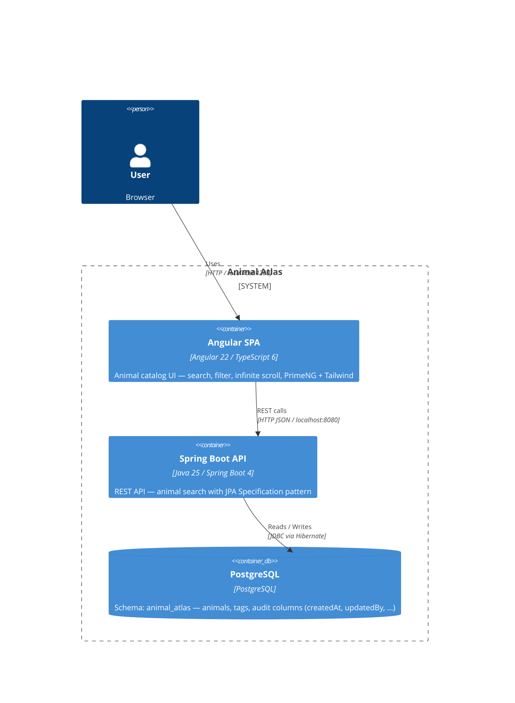
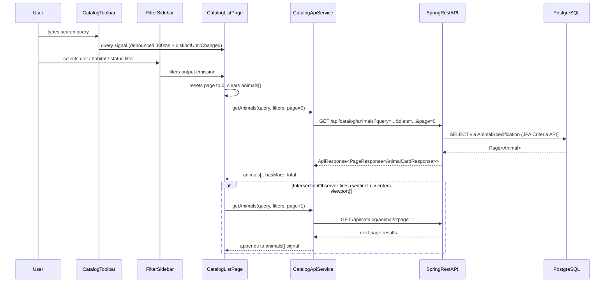

# System Architecture

## Overview

Animal Atlas is a **Full-stack Umbrella** application consisting of two independent Git repositories co-located under a single parent directory. The backend is a **Maven multi-module** project, and the frontend is a **standalone Angular SPA**. Both are decoupled — there is no shared build pipeline — but they communicate via a REST API.

```
D:\Projekty\animal-atlas\
├── animal-catalog-back\   ← Independent git repo (Maven multi-module, Spring Boot 4)
└── animal-catalog-front\  ← Independent git repo (Angular 22 SPA)
```

## Visual Architecture Context

**Diagram type**: C4Container — shows the two deployed containers and the database within the system boundary, plus the external user.



## Architecture Pattern

**Pattern**: Full-stack Umbrella — Layered REST API backend + Angular SPA frontend

The backend follows a **classic layered architecture** within the `catalog` module:

```
REST Layer (Controller) → Service Layer → Repository Layer (Spring Data JPA) → PostgreSQL
                                    ↑
                            Specification (JPA Criteria API)
```

The frontend follows a **feature-based architecture** with smart/dumb component separation and Angular Signals for reactive state management.

## System Structure

### Backend: `animal-catalog-back`

#### `common` module — Cross-cutting infrastructure
- **Location**: `animal-catalog-back/common/`
- **Purpose**: Shared types and auditing infrastructure used by all other modules
- **Key Files**:
  - `ApiResponse<T>` — standard response envelope (success/error)
  - `PageResponse<T>` — paginated response wrapper
  - `ApiMessage` / `MessageType` — typed error/info messages
  - `AuditableEntity` — `@MappedSuperclass` with `createdAt`, `updatedAt`, `createdBy`, `updatedBy`
  - `JpaAuditingConfig` — enables Spring Data JPA auditing
  - `SpringSecurityAuditorAware` — `AuditorAware<String>` implementation

#### `catalog` module — Domain business logic
- **Location**: `animal-catalog-back/catalog/`
- **Purpose**: Core animal catalog feature — entities, services, repositories, API layer
- **Key Files**:
  - `AnimalController` — REST endpoints (`GET /api/catalog/animals`)
  - `AnimalCatalogService` — orchestrates search, delegates to repository and mapper
  - `AnimalRepository` — `JpaRepository<Animal, UUID>` + `JpaSpecificationExecutor<Animal>`
  - `AnimalSpecification` — static factory building `Specification<Animal>` from `AnimalSearchRequest`
  - `AnimalMapper` — MapStruct interface mapping `Animal` → `AnimalCardResponse`
  - `GlobalExceptionHandler` — `@RestControllerAdvice` returning structured `ApiResponse.error()`
  - `CatalogException` / `ErrorCode` — typed exception hierarchy

#### `application` module — Bootstrap & configuration
- **Location**: `animal-catalog-back/application/`
- **Purpose**: Spring Boot entry point, database configuration, environment-specific properties
- **Key Files**: Main application class, `application.yml` (PostgreSQL datasource, `animal_atlas` schema)

### Frontend: `animal-catalog-front`

#### `core` — HTTP infrastructure
- **Location**: `src/app/core/`
- **Purpose**: Provides `HttpClient` and the `API_BASE_URL` injection token to the whole app
- **Key Files**: `core.providers.ts` (`provideCore()`), `api-base-url.token.ts`

#### `shell` — Application layout
- **Location**: `src/app/shell/`
- **Purpose**: Top-level layout wrapper (sticky header + `<router-outlet>`), shell-level routing
- **Key Files**: `shell.component.ts`, `shell.routes.ts`, `header/header.component.ts`

#### `features/catalog` — Animal catalog feature
- **Location**: `src/app/features/catalog/`
- **Purpose**: The primary (and only) feature — browsing and filtering the animal catalog
- **Sub-directories**:
  - `pages/catalog-list-page/` — smart page component (state, infinite scroll, signal orchestration)
  - `components/animal-card/` — dumb display component (input signals)
  - `components/filter-sidebar/` — filter state + output emission
  - `components/catalog-toolbar/` — search (debounced), sort, view-mode toggle
  - `data-access/catalog-api.service.ts` — HTTP service wrapping backend REST calls
  - `models/` — TypeScript interfaces and enums mirroring backend DTOs

## Data Flow

### REST API Request Lifecycle (Backend)

```
GET /api/catalog/animals?query=lion&diets=CARNIVORE&page=0&size=12&sort=name,asc
    ↓ AnimalController.searchAnimals(AnimalSearchRequest, Pageable)
    ↓ AnimalCatalogService.search(request, pageable)
    ↓ AnimalSpecification.from(request)  →  Specification<Animal>  (JPA Criteria API)
    ↓ AnimalRepository.findAll(specification, pageable)  →  Page<Animal>
    ↓ AnimalMapper.toCardResponse(animal)  →  AnimalCardResponse  (MapStruct)
    ↓ PageResponse.from(page)
    → ApiResponse<PageResponse<AnimalCardResponse>>  (JSON)
```

### Frontend Reactive State Flow

```
User types in search → Subject<string> → debounceTime(300) + distinctUntilChanged()
    ↓
CatalogListPageComponent signals: query, filters, page, animals[], isLoading, hasMore
    ↓
CatalogApiService.getAnimals(request)  →  HttpClient → REST API
    ↓
IntersectionObserver (sentinel div) triggers loadMore() → appends to animals[]
```

## Component Communication Flow

**Diagram type**: sequenceDiagram — shows the time-ordered interaction chain from user input (search/filter) through Angular components, the REST API, Specification-driven query, and infinite scroll continuation.



## Domain Model

```
Animal
├── id: UUID (generated)
├── name: String (required)
├── latinName: String
├── shortDescription: String (max 1000 chars)
├── imageUrl: String
├── conservationStatus: AnimalStatus  (LC / NT / VU / EN / CR / EW / EX — IUCN Red List)
├── diet: DietType                    (CARNIVORE / HERBIVORE / OMNIVORE)
├── habitat: HabitatType              (SAVANNA / FOREST / OCEAN / ARCTIC / DESERT / MOUNTAINS / WETLANDS / GRASSLAND)
├── continent: String
├── averageWeightKg: Integer
├── averageLifespanYears: Integer
└── tags: Set<Tag>                    (ManyToMany → animal_tags join table)

Tag
├── id: UUID
├── slug: String (unique)
└── label: String

Both entities extend AuditableEntity (createdAt, updatedAt, createdBy, updatedBy)
```

Database schema: `animal_atlas` (PostgreSQL). Schema currently managed by Hibernate `create-drop` — no migration tool configured yet.

## External Integrations

| Integration | Type | Details |
|---|---|---|
| PostgreSQL | Relational DB | `localhost:5432`, schema `animal_atlas`, credentials in `application.yml` |
| Angular SPA → Backend REST | HTTP/REST | `http://localhost:8080` (hardcoded in `core.providers.ts`) |

No external third-party APIs. No message brokers. No caching layer.

## Configuration

### Backend
- `application/src/main/resources/application.yml` — datasource URL, schema name, JPA settings, server port
- ⚠️ Credentials hardcoded (`username: postgres`, `password: postgres`) — no environment variable substitution
- ⚠️ `ddl-auto: create-drop` — must be changed to `validate` + Flyway/Liquibase before any real data

### Frontend
- `API_BASE_URL` injection token defaults to `http://localhost:8080` — no environment file switching configured
- Prettier config in `.prettierrc` (single quotes, 100-char print width)
- TypeScript config in `tsconfig.json` (ES2022, `"module": "preserve"`, strict flags)

## Deployment Architecture

No deployment infrastructure configured. This is a local development / tech demo setup:
- Backend: run via `./mvnw spring-boot:run` or IDE
- Frontend: run via `ng serve` (Angular CLI dev server, typically port 4200)
- Database: manually provisioned local PostgreSQL instance required

---
*Based on codebase analysis performed 2026-06-05*
