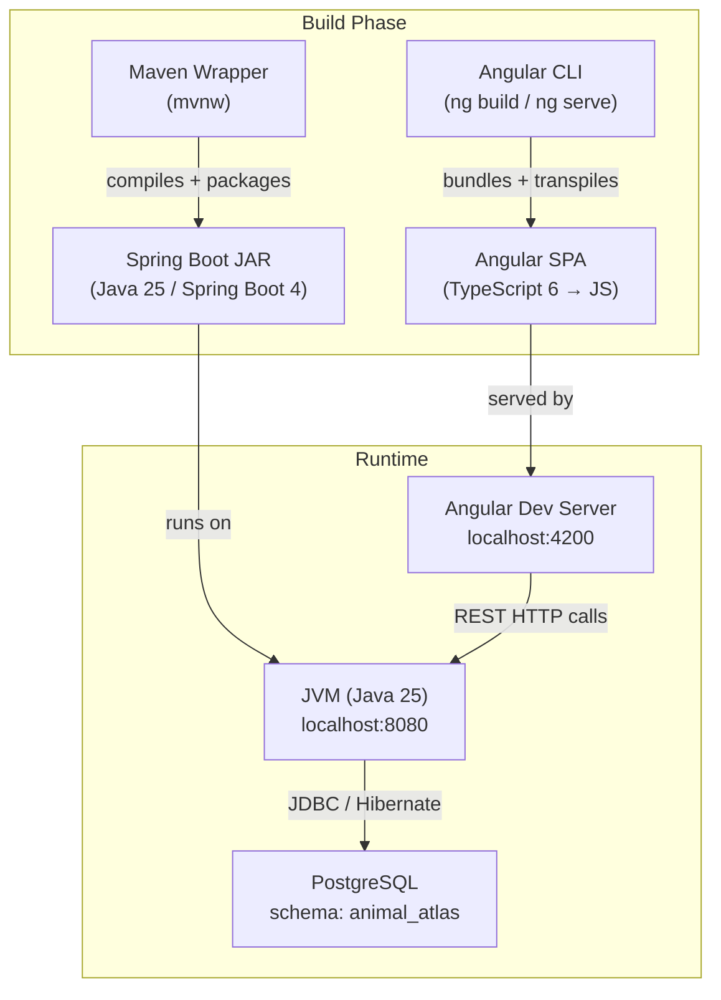

# Technology Stack

## Overview

Animal Atlas is a tech demo / proof of concept showcasing how modern, bleeding-edge technologies work together in a full-stack application. The project uses the absolute latest stable (and pre-release) versions across the entire stack intentionally — it is a living demonstration of Spring Boot 4, Java 25, Angular 22, and TypeScript 6 integration.

## Visual Stack Flow

**Diagram type**: flowchart — shows how the build tools produce artifacts and how those artifacts interact at runtime.

## Languages

### Java (25)
- **Usage**: ~100% of backend codebase
- **Rationale**: Java 25 is used deliberately to showcase the latest JVM features. The project targets cutting-edge Java, including records for DTOs and modern pattern matching.
- **Key Features Used**: Java Records (DTOs), `UUID` primary keys, modern `instanceof` patterns, no Lombok (idiomatic Java 16+ style)

### TypeScript (~6.0.2)
- **Usage**: ~100% of frontend codebase
- **Rationale**: TypeScript 6 pairs with Angular 22 to provide full type safety across the frontend. Strict compiler options (`noImplicitOverride`, `noImplicitReturns`, `noFallthroughCasesInSwitch`) enforce quality.
- **Key Features Used**: Angular Signals (`signal()`, `computed()`, `input()`, `output()`), `"module": "preserve"`, `ES2022` target

## Frameworks

### Frontend

#### Angular (^22.0.0)
- **Rationale**: Angular 22 represents the current frontier of Angular development. The project fully embraces the new Angular Signals reactivity model, replacing legacy `@Input()`/`@Output()` decorators. All components are standalone — no NgModules.
- **Key Patterns**: Signals throughout, lazy-loaded routes at every level, standalone components, `@if`/`@for` control flow, IntersectionObserver for infinite scroll

#### PrimeNG (^21.1.9) + @primeuix/themes (^2.0.3)
- **Rationale**: PrimeNG with the new `@primeuix/themes` package (Aura preset) provides rich UI components. The Aura preset is customized with a warm earth-tone palette (`#FAF7F3`, `#C96F47`, `#2A211D`).
- **Config**: `darkModeSelector: false`

#### Tailwind CSS (^4.3.0)
- **Rationale**: Tailwind 4 (PostCSS-based) provides utility-first CSS. Used alongside PrimeNG for layout (`grid-cols-3` responsive grid), spacing, and typographic utilities. No custom media queries.

### Backend

#### Spring Boot (4.0.6)
- **Rationale**: Spring Boot 4 (targeting Spring Framework 6.x on JDK 25) is the latest major release. The project uses Spring MVC (not WebFlux), Spring Data JPA, and Spring Boot Validation.
- **Key Modules**: `spring-boot-starter-webmvc`, `spring-boot-starter-data-jpa`, `spring-boot-starter-validation`

#### MapStruct (1.6.3)
- **Rationale**: Compile-time, annotation-based bean mapping between JPA entities and DTOs (records). Zero runtime overhead, fully type-safe.

### Testing

#### Backend
- `spring-boot-starter-data-jpa-test` — `@DataJpaTest` slice for repository/specification testing
- `spring-boot-starter-webmvc-test` — `@WebMvcTest` slice for controller testing
- ⚠️ **Status**: Dependencies declared but no test files written yet

#### Frontend
- **Vitest (^4.0.8)** — fast Vite-native test runner replacing Jest
- **jsdom (^28.0.0)** — DOM environment for component tests
- ⚠️ **Status**: Only boilerplate `app.spec.ts` exists; no real tests implemented

## Database

### PostgreSQL (runtime)
- **Type**: Relational (RDBMS)
- **Schema**: `animal_atlas`
- **ORM/Client**: Spring Data JPA + Hibernate (via Spring Boot 4 auto-configuration)
- **Rationale**: PostgreSQL is the standard choice for Spring Boot applications with relational data. The domain model has a clean many-to-many (`Animal ↔ Tag`) relationship.
- ⚠️ **Current state**: `ddl-auto: create-drop` — schema is recreated on every restart (development only; must be changed before any real data persistence)

## Build Tools & Package Management

### Backend — Maven (Maven Wrapper `mvnw`)
- Multi-module parent POM aggregating `common`, `catalog`, and `application` modules
- Maven Wrapper ensures consistent Maven version across environments

### Frontend — npm (11.11.1)
- Defined via `"packageManager": "npm@11.11.1"` in `package.json`
- Angular CLI (`@angular/build ^22.0.0`) drives the build pipeline

## Infrastructure

### Containerization
- ⚠️ **Not configured** — no `Dockerfile` or `docker-compose.yml` exists. Developers must manually run a local PostgreSQL instance.
- **Recommendation**: Add `docker-compose.yml` with a PostgreSQL service for a one-command dev environment.

### CI/CD
- `.github/modernize/java-upgrade/hooks/scripts` exists in the backend repo — suggests a Java version upgrade automation workflow (likely AI-assisted or GitHub Actions-powered).
- No general CI/CD pipeline (build + test) detected.

### Hosting
- Not configured (tech demo / local development only)

## Development Tools

### Linting & Formatting

#### Prettier (^3.8.1)
- **Config** (`.prettierrc`):
  - `singleQuote: true`
  - `printWidth: 100`
  - `htmlParser: "angular"` overrides for `.html` files

### Type Checking
- TypeScript strict-mode partial: `noImplicitOverride`, `noImplicitReturns`, `noFallthroughCasesInSwitch` enabled
- `"module": "preserve"` for native ESM compatibility

### IDE
- IntelliJ IDEA (`.idea/` directory present in backend)

## Key Dependencies

| Dependency | Version | Purpose |
|---|---|---|
| Spring Boot | 4.0.6 | Backend framework |
| Java | 25 | Backend language |
| MapStruct | 1.6.3 | Entity ↔ DTO mapping |
| Angular | ^22.0.0 | Frontend framework |
| TypeScript | ~6.0.2 | Frontend language |
| PrimeNG | ^21.1.9 | UI component library |
| @primeuix/themes | ^2.0.3 | PrimeNG theming (Aura preset) |
| Tailwind CSS | ^4.3.0 | Utility-first CSS |
| RxJS | ~7.8.0 | Reactive extensions (Angular) |
| Vitest | ^4.0.8 | Frontend testing |
| Prettier | ^3.8.1 | Code formatting |
| PostgreSQL | (runtime) | Relational database |

## Version Management

- **Backend**: Maven `<properties>` in root `pom.xml` centralizes all version definitions (`java.version`, `mapstruct.version`, etc.). Spring Boot BOM handles transitive dependency alignment.
- **Frontend**: `package.json` with `^` ranges for minor/patch auto-upgrades. `packageManager` field pins npm version.

---
*Last Updated*: 2026-06-05
*Auto-detected*: Full tech stack (all versions from `pom.xml` and `package.json`), architecture type, conventions, testing setup
